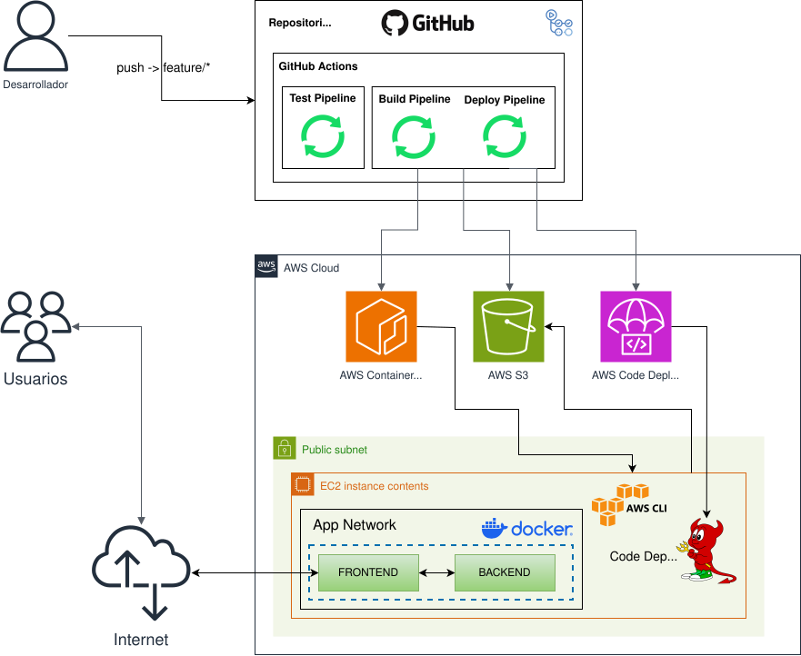

# Taller de DevOps con un Monorepositorio - AWS

Este repositorio tiene como proposito mostrar el despliegue de una aplicación *FullStack* en la nube de AWS mediante flujos de CI/CD con GitHub Actions, construyendo la imágen del *Backend* y *Frontend* en un repositorio de AWS Container Registry y el despliegue con Code Deploy y S3 en una instancia de EC2 utilizando el protocolo OIDC para la *Autenticación* y *Autorización* con AWS y GitHub.

## Arquitectura y flujo de construcción

